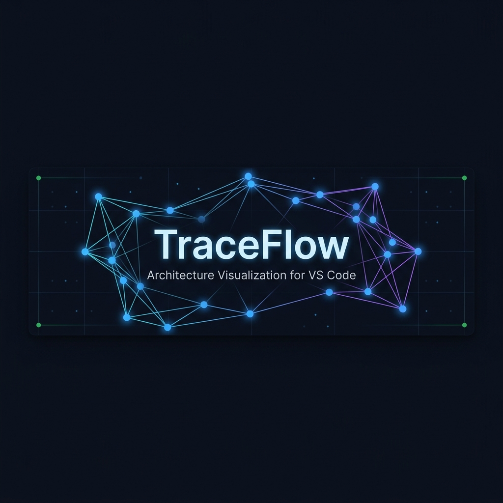
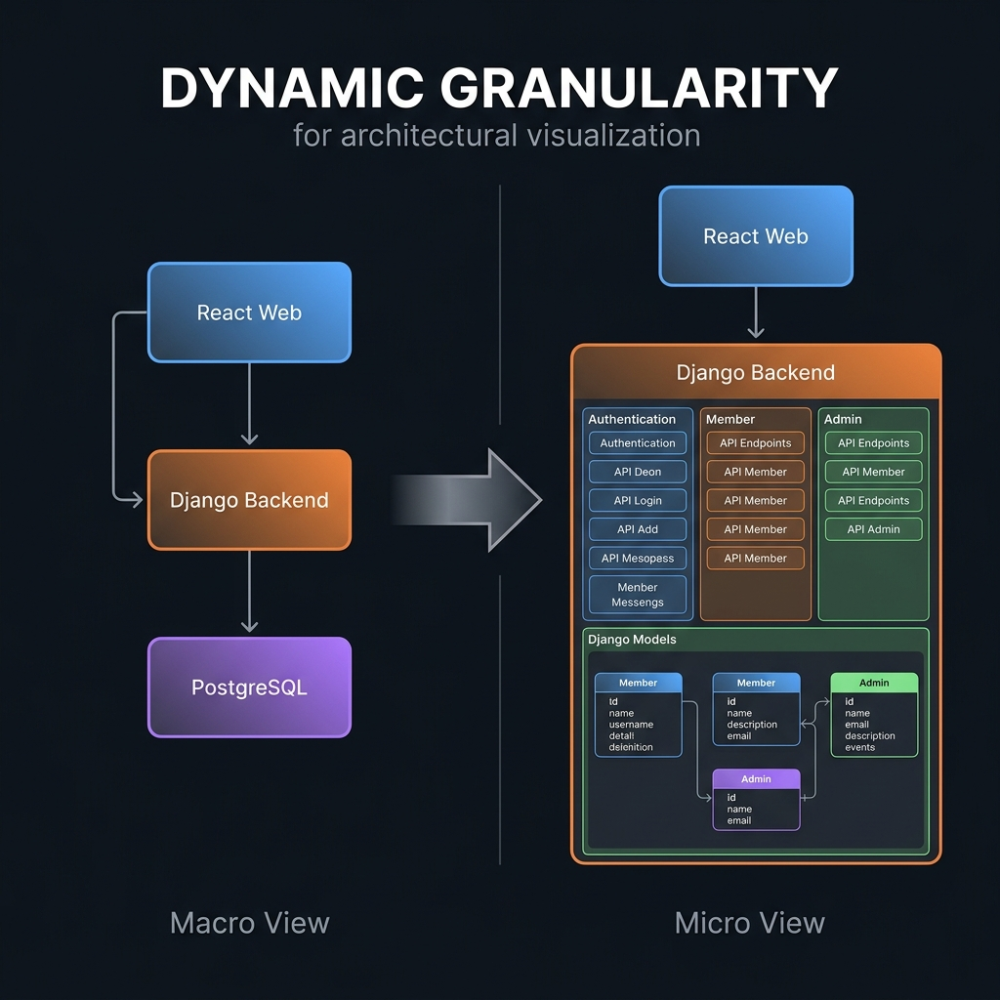
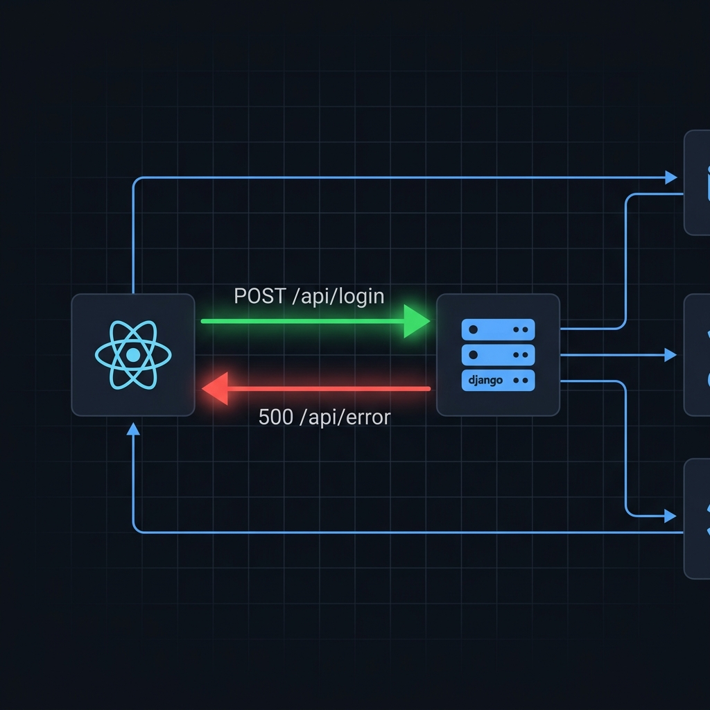
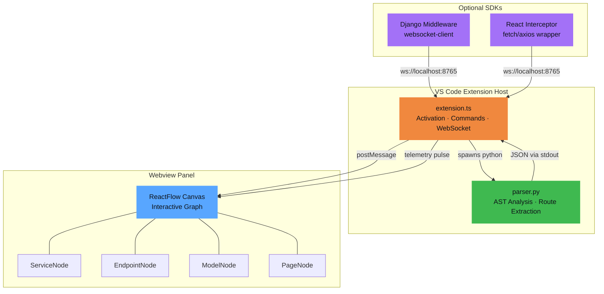

<p align="center">
  
</p>

<p align="center">
  <strong>See your architecture. Watch your traffic. Understand your system.</strong>
</p>

<p align="center">
  <a href="#-quick-start"></a>
  <a href="#-features"></a>
  <a href="#-live-telemetry"></a>
</p>

<p align="center">
  <a href="https://www.patreon.com/xand0dev" target="_blank"></a>
  <a href="https://github.com/sponsors/xand0dev" target="_blank"></a>
</p>

<p align="center">
  <a href="https://marketplace.visualstudio.com/items?itemName=xand0dev.traceflow-viz"></a>
  <a href="https://open-vsx.org/extension/xand0dev/traceflow-viz"></a>
  
  
  
  
</p>

---

## What is TraceFlow?

**TraceFlow** is a VS Code extension that turns your codebase into an **interactive, visual architecture map** — right inside your editor. It statically analyzes your project (Django + React + React Native) using Python's `ast` module and renders a live ReactFlow graph with expandable service nodes, grouped endpoints, and optional real-time HTTP telemetry.

> **Zero config. Zero code changes. Read-only.** Just point it at your project root.

---

## ✨ Features

### 🔍 Smart Auto-Discovery

TraceFlow automatically detects your entire stack with a single folder selection:

| Component | Detection Method |
|:---|:---|
| **Django Backend** | Finds `manage.py` → parses `settings.py` → follows `ROOT_URLCONF` |
| **React Web Apps** | Finds `package.json` with `react-dom` or `vite` dependency |
| **React Native Apps** | Finds `package.json` with `react-native` or `expo` dependency |
| **Database** | Reads `DATABASES` config from Django settings |

---

### 🎯 Dynamic Granularity

Click any service to drill down. Click again to collapse. The graph smoothly re-layouts.

<p align="center">
  
</p>

<table>
<tr>
<td width="50%">

**📦 Collapsed (Macro View)**
- Bird's-eye view of your architecture
- Service boxes show summary stats
- *"3 pages" · "42 endpoints" · "12 models"*

</td>
<td width="50%">

**🔬 Expanded (Micro View)**
- Endpoints grouped by business domain
- Models with field listings
- Frontend pages/screens in a 3-column grid

</td>
</tr>
</table>

---

### 🏷️ Smart Endpoint Grouping

Backend endpoints aren't just a flat list — they're automatically categorized by business domain:

| Group | Icon | Examples |
|:---|:---:|:---|
| Authentication | 🔐 | `/api/login/`, `/api/register/`, `/api/token/` |
| Member / Profile | 👤 | `/api/profile/`, `/api/membership/` |
| Admin Panel | 🛡️ | `/api/admin/users/`, `/api/admin/stats/` |
| Owner / SaaS | 👑 | `/api/owner/gyms/`, `/api/owner/dashboard/` |
| Trainer | 🏋️ | `/api/trainer/schedule/`, `/api/trainer/clients/` |
| Payments | 💳 | `/api/payments/`, `/api/subscriptions/` |
| Import / Export | 📊 | `/api/export/csv/`, `/api/import/` |
| System / Docs | ⚙️ | `/api/health/`, `/api/schema/`, `/swagger/` |
| Public API | 🌐 | Everything else |

---

### ⚡ Live Telemetry

<p align="center">
  
</p>

Watch your architecture come **alive**. Drop in a lightweight middleware (Django) and interceptor (React), and every HTTP request animates as a glowing pulse on the graph:

- 🟢 **Green pulse** — `2xx` success
- 🔴 **Red pulse** — `4xx`/`5xx` error
- Edge glows for 2 seconds, then fades

> All traffic stays local — `ws://localhost:8765`. Nothing ever leaves your machine.

---

## 🚀 Quick Start

### Prerequisites

- **VS Code** ≥ 1.85
- **Python** ≥ 3.10 (for the parser)
- **Node.js** ≥ 18 (for building)

### Install

**Option 1: Visual Studio Marketplace (Recommended)**
1. Open VS Code.
2. Go to the Extensions tab (`Ctrl+Shift+X`).
3. Search for **TraceFlow**.
4. Click **Install**.

**Option 2: Manual VSIX Install (For Antigravity IDE / VSCodium)**
1. Download the latest `traceflow-viz-0.1.0.vsix` from the [Releases](https://github.com/xand0dev/TraceFlow/releases).
2. Open your IDE's Extensions panel.
3. Click `...` in the top right → **Install from VSIX...**
4. Select the downloaded file.

### Building from Source

```bash
# 1. Clone the repo
git clone https://github.com/xand0dev/TraceFlow.git
cd TraceFlow

# 2. Install dependencies & build
npm install
npm run package

# 3. Launch in VS Code Extension Host
#    Press F5
```

---

## 🏗️ Architecture



---

## 🔌 Live Telemetry Setup (Optional)

### Django Middleware

```python
# Copy sdk/django_middleware.py → your_project/core/middleware.py

# settings.py
MIDDLEWARE = [
    # ... other middleware
    'core.middleware.TraceFlowTelemetryMiddleware',
]

# pip install websocket-client
```

### React Interceptor

```javascript
// Copy sdk/telemetry_client.js → your src/ folder

// App.js or index.js
import { initTraceFlow } from './telemetry_client';
initTraceFlow(); // connects to ws://localhost:8765
```

---

## 🔒 Security Guarantees

| Concern | Guarantee |
|:---|:---|
| **File System** | 🔒 Strictly **read-only**. Uses `ast.parse()`, never `import` or `exec()`. |
| **Network** | 🔒 All telemetry over `ws://localhost:8765`. Zero external connections. |
| **Webview** | 🔒 Strict CSP with generated nonces. No inline scripts. |
| **Target Project** | 🔒 Never modifies, creates, or deletes any file in the scanned project. |

---

## 🛠️ Tech Stack

<table>
<tr>
<td align="center" width="33%">

**Extension Host**

TypeScript · VS Code API · WebSocket

</td>
<td align="center" width="33%">

**Webview UI**

React · ReactFlow · esbuild

</td>
<td align="center" width="33%">

**Parser Engine**

Python 3 · `ast` module · Regex

</td>
</tr>
</table>

---

## 📁 Project Structure

```
TraceFlow/
├── src/
│   ├── extension.ts          # VS Code activation, commands, WebSocket server
│   ├── parser.py             # Python AST parser (Django + React + RN)
│   └── webview/
│       ├── App.tsx            # Main ReactFlow canvas & layout engine
│       ├── styles.css         # Dark theme styles
│       └── nodes/
│           ├── ServiceNode.tsx    # Expandable service blocks
│           ├── EndpointNode.tsx   # API endpoint pills
│           ├── ModelNode.tsx      # Django model cards
│           └── PageNode.tsx       # Frontend page/screen items
├── sdk/
│   ├── django_middleware.py   # Optional Django telemetry middleware
│   └── telemetry_client.js    # Optional React/RN telemetry interceptor
├── docs/images/               # README assets
├── package.json
└── tsconfig.json
```

---

## 🗺️ Roadmap

- [ ] **FastAPI / Express** parser support
- [ ] **Flutter** screen detection
- [ ] **Docker Compose** service discovery
- [ ] **GraphQL** schema visualization
- [ ] **VS Code Marketplace** publishing
- [ ] **Export** graph as SVG/PNG
- [ ] **Search** — find endpoint/model by name

---

<p align="center">
  <sub>Built with ❤️ as an MVP for architectural observability</sub>
</p>
